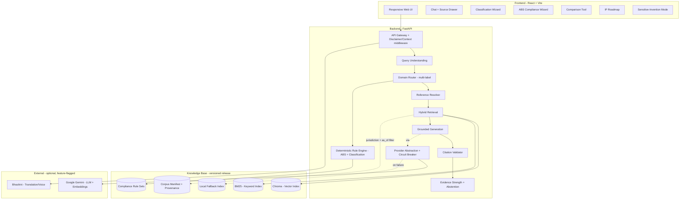
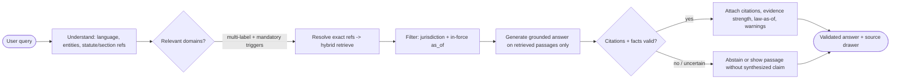
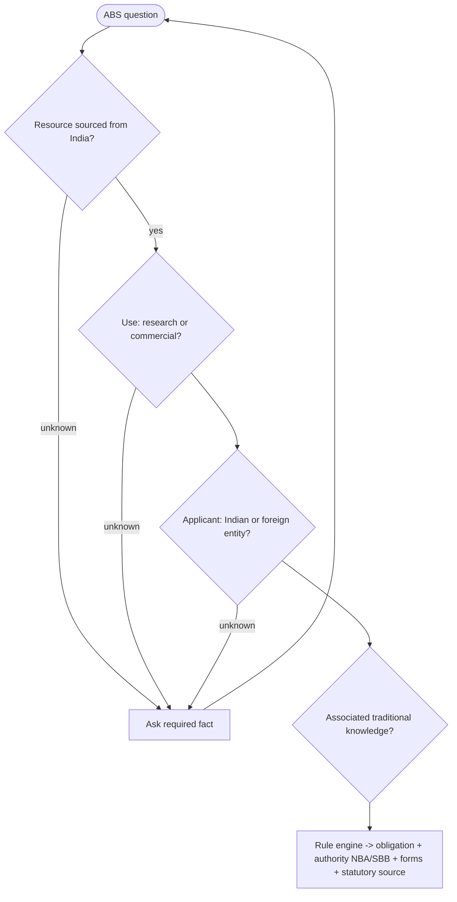

# IP-SAKTI Sahayak — Implementation Plan

**A multilingual, citation-backed AI assistant for Intellectual Property and regulatory guidance in Ayurveda — covering national and international regimes.**
*Smart India Hackathon 2026 · Problem Statement 45 · Ministry of AYUSH*

---

## 1. Background & Goal

Ayurveda practitioners, researchers, AYUSH startups and MSMEs, and cultivators lack an authoritative, plain-language tool to navigate overlapping IP regimes (patents, GI, trademarks, trade secrets, plant-variety rights), Access-and-Benefit-Sharing (ABS) obligations, and drug-regulatory classifications. The relevant law is scattered across many statutes, rarely available in Indian languages, and hard to trust.

**IP-SAKTI Sahayak** brings IP, traditional-knowledge risk, ABS, regulatory classification, and key international pathways into one guided, citation-grounded workflow, backed by a curated legal corpus. Every answer maps to an official source the user can open and verify. The goal is to help users reach the **right question, the right form, the right authority, and the right professional faster** — not to replace legal or regulatory experts.

**What separates it from a generic chatbot:** a verified official corpus, answers that must map to a validated source passage, awareness of which law is currently in force, deterministic compliance logic, a locked multilingual legal glossary, an offline-capable fallback, and full auditability.

---

## 2. Design Principles (product guarantees)

These hold across every feature: chat, wizards, comparison, roadmap, and exported reports.

1. **No claim without a citation.** Every substantive statement links to a specific source passage (document, section, page). The model can only cite from what was actually retrieved; it cannot invent sources.
2. **Show the evidence.** Users can open the exact cited passage in-app, alongside the official source link (served locally too, so citations never break during a demo).
3. **Current law by default.** Answers use the in-force version and display a visible "law as of <date>".
4. **Fail safe, not confident.** When the corpus lacks an answer, facts are missing, or sources conflict, the assistant abstains or shows the raw source instead of guessing.
5. **Guidance, not legal opinion.** Outputs are risk indicators and "questions to discuss with a professional." Filing/compliance decisions escalate to a qualified professional / NBA / SBB.

---

## 3. Architecture Overview



The system is **offline-capable**: if Gemini is unavailable, it returns an extractive, still-cited answer via the local fallback index instead of failing.

---

## 4. Answer Workflow



Compliance questions (ABS / classification) additionally run the **deterministic rule engine**, which decides the obligation; the model only explains it.

---

## 5. Project Structure

```
ip-sakti/
├── docker-compose.yml
├── .env.example
├── README.md
│
├── frontend/                              # React + Vite
│   ├── package.json
│   ├── vite.config.js
│   ├── index.html
│   ├── Dockerfile
│   ├── public/
│   │   ├── favicon.svg
│   │   └── fonts/
│   └── src/
│       ├── main.jsx
│       ├── App.jsx                        # Routes + context providers
│       ├── index.css                      # Design tokens + global styles
│       ├── api/
│       │   └── client.js                  # Fetch wrapper for backend API
│       ├── context/
│       │   ├── JurisdictionContext.jsx    # India vs International state
│       │   ├── LanguageContext.jsx        # Active language state
│       │   └── ThemeContext.jsx           # Dark/light mode
│       ├── hooks/
│       │   ├── useChat.js                 # Chat state, request lifecycle
│       │   ├── useClassification.js       # Classification wizard state machine
│       │   └── useAbs.js                  # ABS wizard state machine
│       ├── pages/
│       │   ├── Landing.jsx                # Hero + feature overview + disclaimer
│       │   ├── Chat.jsx                    # Main chat interface
│       │   ├── ClassificationWizard.jsx
│       │   ├── ABSWizard.jsx
│       │   ├── ComparisonTool.jsx
│       │   ├── Roadmap.jsx
│       │   └── Diagnostics.jsx            # Health/telemetry view
│       ├── components/
│       │   ├── layout/
│       │   │   ├── Header.jsx  Sidebar.jsx  Footer.jsx  Layout.jsx
│       │   ├── chat/
│       │   │   ├── ChatMessage.jsx        # Answer + inline citation chips
│       │   │   ├── ChatInput.jsx          # Text input (+ optional voice)
│       │   │   ├── SourceDrawer.jsx       # Exact passage + section/page + links
│       │   │   ├── EvidenceStrengthBadge.jsx
│       │   │   ├── LawAsOfBadge.jsx
│       │   │   ├── AnswerModeBadge.jsx    # live / extractive / cached
│       │   │   └── AbstentionNotice.jsx
│       │   ├── jurisdiction/
│       │   │   └── JurisdictionToggle.jsx
│       │   ├── wizard/
│       │   │   ├── WizardStep.jsx  WizardProgress.jsx
│       │   │   ├── ClassificationResult.jsx  AbsResult.jsx
│       │   ├── roadmap/
│       │   │   └── IPRoadmap.jsx
│       │   ├── comparison/
│       │   │   └── ComparisonTable.jsx
│       │   └── common/
│       │       ├── Button.jsx  Card.jsx  Modal.jsx  Tooltip.jsx  Badge.jsx
│       │       ├── DisclaimerBanner.jsx  LanguageSelector.jsx
│       │       ├── SensitiveModeToggle.jsx  PDFExportButton.jsx  ThemeToggle.jsx
│       └── utils/
│           ├── constants.js               # Classification trees, jurisdiction config
│           └── formatCitation.js
│
├── backend/                               # Python + FastAPI
│   ├── pyproject.toml
│   ├── requirements.txt
│   ├── Dockerfile
│   └── app/
│       ├── main.py                        # FastAPI app, CORS, router mounts
│       ├── config.py                      # Settings from env vars
│       ├── dependencies.py
│       ├── api/
│       │   ├── routes/
│       │   │   ├── chat.py                # POST /api/chat
│       │   │   ├── classify.py            # POST /api/classify
│       │   │   ├── abs_check.py           # POST /api/abs/check
│       │   │   ├── search.py              # GET  /api/search
│       │   │   ├── roadmap.py             # POST /api/roadmap
│       │   │   ├── compare.py             # POST /api/compare
│       │   │   ├── export.py              # POST /api/export/pdf
│       │   │   └── health.py              # GET  /api/health
│       │   └── middleware/
│       │       ├── disclaimer.py          # Inject disclaimer into responses
│       │       ├── rate_limit.py          # Global + per-IP budget (no accounts)
│       │       └── request_context.py     # Pin request to the active release
│       ├── workflow/
│       │   ├── schema.py                  # Typed contracts (ChatResponse, Claim, Source)
│       │   ├── pipeline.py                # Orchestrates the answer workflow
│       │   ├── query_understanding.py     # Language detect, entity + reference extraction
│       │   ├── domain_router.py           # Multi-label domains + mandatory triggers
│       │   ├── reference_resolver.py      # Exact Section/Form/Act resolution
│       │   ├── generation.py              # Grounded generation on evidence IDs only
│       │   ├── citation_validator.py      # Verify citations + facts, drop unsupported
│       │   ├── evidence_strength.py       # Composite evidence-strength scoring
│       │   └── abstention.py              # Fail-safe / abstain rules
│       ├── retrieval/
│       │   ├── hybrid.py                  # Vector + keyword fusion (RRF)
│       │   ├── vector_store.py            # Chroma wrapper
│       │   ├── keyword_index.py           # BM25 wrapper
│       │   ├── fallback_index.py          # Local sparse index (extractive fallback)
│       │   ├── chunking.py                # Legal-aware, section-boundary chunking
│       │   └── embeddings.py              # Embedding model config (+ local option)
│       ├── rules/
│       │   ├── engine.py                  # Deterministic rule evaluator
│       │   ├── dsl.py                     # Rule format + loader/validator
│       │   ├── abs_rules.py               # Versioned ABS obligation rules
│       │   └── classification_rules.py    # Formulation classification decision tree
│       ├── corpus/
│       │   ├── manifest.py                # Versioned manifest + provenance + licence
│       │   ├── ingestion.py               # PDF/HTML -> chunks -> indexes
│       │   └── sources.py                 # Source registry (URL, publisher, authority)
│       ├── integrations/
│       │   ├── provider.py                # LLM provider abstraction + circuit breaker
│       │   ├── gemini.py                  # Google Gemini (LLM + embeddings)
│       │   └── bhashini.py                # Translation (voice optional)
│       ├── i18n/
│       │   ├── glossary.py                # Locked bilingual legal glossary
│       │   └── translate.py               # Translate with term preservation
│       ├── offline/
│       │   ├── precompute.py              # Persist embeddings/indexes
│       │   └── cache.py                   # Approved demo-scenario cache
│       ├── models/
│       │   ├── schemas.py                 # Pydantic request/response models
│       │   └── enums.py                   # Jurisdiction, FormulationType, ForceState, EvidenceStrength
│       └── utils/
│           ├── pdf_generator.py           # Cited PDF reports from the validated object
│           ├── logger.py                  # Structured logging (redacted)
│           └── security.py                # Input sanitization, injection boundary
│   └── tests/
│       ├── test_chat.py  test_citation_validation.py  test_temporal.py
│       ├── test_abs_rules.py  test_classification.py  test_retrieval.py
│       ├── test_offline_fallback.py
│       └── smoke_demo.py                  # One-command end-to-end demo check
│
├── corpus/                                # Curated public documents (git-tracked)
│   ├── national/
│   │   ├── statutes/                      # Patents, Biodiversity, GI, TM, Designs, Copyright, D&C
│   │   ├── ayush_guidelines/
│   │   ├── dpiit_tk_guidelines/
│   │   └── pharmacopoeia/                 # API/AFI extracts (public)
│   ├── international/
│   │   ├── trips/
│   │   └── pct/
│   └── manifest.json                      # Provenance + version + licence per document
│
├── eval/
│   ├── testset.jsonl                      # Curated questions + expected sources
│   ├── run_eval.py                        # Retrieval + citation-validity + abstention metrics
│   └── report.md                          # Generated results (with sample size)
│
└── scripts/
    ├── ingest_corpus.py                   # Build corpus + indexes from manifest
    ├── build_indexes.py
    └── verify_release.py                  # Integrity check before serving
```

---

## 6. Data Contracts & Schemas

The same validated answer object powers chat, comparison cells, roadmap steps, wizard explanations, and PDF export — nothing user-visible bypasses citation checks.

**Answer contract** (`workflow/schema.py`):
```
ChatResponse:
  claims:  [ { text: str, sources: [source_id] } ]
  sources: [ { id, title, section, page, url, local_excerpt,
               status, authority, as_of } ]
  warnings: [str]                 # scope limits, missing domains, uncertainty
  answer_mode: "live" | "extractive" | "cached"
  evidence_strength: { level: "high"|"moderate"|"limited",
                       factors: { coverage, exact_section, agreement, authority, recency } }
  jurisdiction: "india" | "international"
  language: str
```

**Enums** (`models/enums.py`):
```
Jurisdiction     = INDIA | INTERNATIONAL
ForceState       = IN_FORCE | NOT_YET_IN_FORCE | REPEALED
EvidenceStrength = HIGH | MODERATE | LIMITED
FormulationType  = CLASSICAL | PROPRIETARY | NEW_DRUG | PHYTOPHARMACEUTICAL | NUTRACEUTICAL | COSMETIC
Domain           = PATENT | GI_TRADEMARK | ABS | REGULATORY | TK_RISK | INTERNATIONAL
```

**Corpus manifest entry** (`corpus/manifest.json`):
```
{ "id": "bda_2002_s7",
  "title": "Biological Diversity Act, 2002 - Section 7",
  "url": "https://www.indiacode.nic.in/...", "publisher": "India Code",
  "version": "2023-amended", "document_hash": "sha256:...",
  "effective_date": "2004-04-01", "status": "in_force",
  "authority_level": "statute",            # statute > rule/notification > guideline > treaty > article
  "license": "government",
  "jurisdiction": "india", "domains": ["abs"] }
```

**Compliance rule** (`rules/dsl.py`) — versioned, cites its legal basis, asks when facts are missing:
```
{ "id": "abs_commercial_indian_entity",
  "when": { "resource_origin": "india", "use": "commercial", "applicant": "indian_entity" },
  "then": { "obligation": "prior_intimation_to_SBB",
            "authority": "State Biodiversity Board",
            "forms": ["Form I"], "source_id": "bda_2002_s7", "rule_version": "2024.1" },
  "requires": ["resource_origin", "use", "applicant"] }   # if missing -> ask; never conclude
```

---

## 7. Legal Domain Coverage

The assistant reasons over six domain profiles. Each profile is a **retrieval scope + rule set**, not a separate agent, so a single question can span several without routing gaps.

| Domain profile | Covers (statutes / instruments) |
|---|---|
| **Patent** | Patents Act 1970 + Patents Rules (incl. 2024 amendments); Section 3(p) (traditional-knowledge bar); patentability criteria for Ayurvedic innovations; specification/priority basics; PCT national-phase route. |
| **GI / Trademark** | Geographical Indications of Goods Act 1999; Trade Marks Act 1999; Designs Act 2000; Copyright Act 1957 — brand protection, GI for region-specific formulations, packaging/design protection. |
| **ABS (Biodiversity)** | Biological Diversity Act 2002 (as amended 2023) + Rules (incl. 2024); NBA / SBB procedures; ABS obligations for commercial use of biological resources; benefit-sharing; Nagoya Protocol linkage. |
| **Regulatory** | Drugs & Cosmetics Act 1940 (AYUSH provisions) + Rules; Drugs and Magic Remedies (Objectionable Advertisements) Act 1954; FSSAI nutraceutical regulations; AYUSH licensing, labeling and advertising norms. |
| **TK-Risk** | DPIIT "Guidelines for Processing of Patent Applications relating to TK & Biological Material"; public TKDL overview; classical-text references — flags *possible* TK risk only (no full-TKDL access). |
| **International** (demo: PCT + TRIPS TK bar) | TRIPS (traditional-knowledge / prior-art bar), PCT basics. Reference-only (roadmap): CBD, Nagoya Protocol, WIPO GRATK Treaty 2024, Madrid, Hague, Budapest, EU THMPD, US FDA (DSHEA), WHO traditional-medicine guidance. |

Anything not backed by the versioned corpus is clearly labelled reference-only and never presented as a definitive answer.

---

## 8. How an Answer Is Produced (module detail)

1. **Query understanding** (`query_understanding.py`) — detect language; extract entities (formulation, biological resource, product type) and explicit statute/section/form references (e.g. "Section 3(p)", "Form I").
2. **Domain routing** (`domain_router.py`) — multi-label classification into the six profiles. **Mandatory triggers** fire on detected facts (a biological resource used commercially always triggers ABS). If a relevant profile cannot be covered, the answer discloses it rather than silently omitting it.
3. **Reference resolution + retrieval** (`reference_resolver.py`, `retrieval/hybrid.py`) — resolve exact references first, then retrieve passages via combined semantic + keyword search (reciprocal-rank fusion), filtered to jurisdiction and in-force law.
4. **Grounded generation** (`generation.py`) — the model answers using only retrieved passages, cites them inline, and may not add facts or sources from outside the retrieved set.
5. **Citation validation** (`citation_validator.py`) — confirm each citation maps to a real retrieved passage; verify specific facts (section numbers, dates, amounts) against the source; drop unsupported statements or abstain.
6. **Evidence strength + response** (`evidence_strength.py`, `abstention.py`) — attach a labelled evidence-strength indicator, warnings, the "law as of" date, and an openable source drawer.

---

## 9. Legal Correctness

- The corpus stores the **currently in-force** version of each Act, Rule, and notification, tagged with source, section, effective date, and status (`ForceState`).
- Answers default to current law and always display **"law as of <date>"**.
- Superseded, uncertain, or conflicting provisions trigger a warning and a recommendation to confirm with an official source or professional.
- Scope is honest: the demo focuses on **central law**; state-level licensing questions produce a referral to the relevant state authority.

---

## 10. Deterministic Compliance Engine

Compliance outcomes must be reproducible, so ABS obligations and formulation classification are decided by **versioned rule sets** (`rules/`), not free-form reasoning. Each rule cites its legal source; the model only explains the outcome. If required facts are missing, the engine asks follow-up questions and returns "insufficient information" rather than a conclusion.



**ABS wizard — exact questions** (`ABSWizard.jsx`):
1. Are you using biological resources sourced from India? (Yes / No)
2. Is the use for research, commercial application, or bio-survey? (Research / Commercial / Bio-survey)
3. Are you an Indian entity or foreign? (Indian / Foreign)
4. Does your product use traditional knowledge associated with the biological resource? (Yes / No)
- **Result:** obligations (NBA/SBB), required forms, benefit-sharing note, and the citing statute — with an "insufficient information" path if any required answer is unknown.

---

## 11. Classification Wizard

**Formulation classification — exact decision tree** (`ClassificationWizard.jsx`, `rules/classification_rules.py`):
1. Is your formulation described in a First-Schedule authoritative text (e.g. Charaka Samhita, Sushruta Samhita)? (Yes / No / Not sure)
2. *(if Yes)* Are you using the exact formulation and method from the text, or have you modified it? (Exact / Modified)
3. *(if No / Modified)* Does your product contain novel active compounds or a novel extraction method? (Yes / No)
4. Is the product intended as a medicine, food supplement, or cosmetic? (Medicine / Food / Cosmetic)
- **Result:** `FormulationType`, regulatory category, IP posture summary, and recommended next steps — every branch mapped to its legal source and rule version. Each step shows an info tooltip explaining its regulatory significance.

---

## 12. Knowledge Sources (Corpus)

All demo sources are **free and public**, stored with provenance (source URL, publisher, version, effective date, authority level, licence). Only public-domain, government, or open-licensed material is ingested as full text.

**Core corpus:** Patents Act 1970 + Rules (incl. S.3(p)); Biological Diversity Act 2002 (amended 2023) + Rules; Trade Marks Act 1999; GI Act 1999; Designs Act 2000; Copyright Act 1957; Drugs & Cosmetics Act (AYUSH provisions); Drugs & Magic Remedies Act 1954; FSSAI nutraceutical regulations; Ministry of AYUSH guidelines; DPIIT TK & biological-material patent guidelines; public TKDL overview; TRIPS (TK bar) and PCT basics.

**Sources:** India Code, ipindia.gov.in, ayush.gov.in, WIPO. The corpus is versioned; documents are added through a validated ingestion step (not live scraping), so the demo always runs on a known, stable knowledge base.

---

## 13. Retrieval Design

- **Hybrid search** (`retrieval/hybrid.py`) — semantic (vector) + keyword (BM25) via reciprocal-rank fusion, so both conceptual questions and exact references are handled well.
- **Legal-aware chunking** (`retrieval/chunking.py`) — split along section/heading boundaries so a clause stays connected to its context; each chunk retains section, jurisdiction, and effective-date metadata; provisos/explanations kept with their parent clause; tables/forms extracted separately.
- **Authority-aware ordering** — official statutes and notifications outrank secondary summaries; results filtered by jurisdiction and in-force status before ranking.

---

## 14. Reliability & Offline Mode

- **Offline-first fallback** (`offline/`, `retrieval/fallback_index.py`) — embeddings and indexes are precomputed and persisted. If the cloud LLM is rate-limited or unavailable, the assistant returns an **extractive** answer (best matching passages with citations) instead of failing.
- **Provider resilience** (`integrations/provider.py`) — timeouts, retries, circuit breaker, and a health indicator; the corpus is never re-indexed at startup.
- **Demo safety** — scripted demo questions have cached, verified answers as an outage fallback (clearly labelled); at least one unseen judge question is answered live to prove real capability.

---

## 15. Privacy, Trust & Safety

- **Sensitive-Invention mode** — for confidential formulations, the assistant runs local/extractive-only with no external LLM calls; the user is warned before any data would leave the device.
- **Data minimisation** — no raw queries or audio retained by default; anonymous sessions; short defined retention; external processing disclosed before translation/voice.
- **Persistent disclaimer** — every screen shows "informational guidance, not legal advice."
- **Safe inputs** (`utils/security.py`) — retrieved and uploaded content is treated strictly as reference data, never as instructions to the system; ingestion is disabled in public demo mode.

---

## 16. Multilingual Support

- **Demo languages:** English, Hindi, Telugu (text). Voice optional behind a feature flag.
- **Legal-term fidelity** (`i18n/glossary.py`) — a locked bilingual legal glossary; statute names, section numbers, and defined terms preserved verbatim; the normalized English query shown for confirmation in wizard flows.
- The assistant abstains when a translation would materially change a compliance input.

---

## 17. Frontend & User Experience

**Design system** (`index.css`) — CSS custom properties, dark/light mode via `[data-theme]`:
- **Primary theme:** white neo-brutalist — white background, thick black borders, hard offset shadows, bold chunky headings, bright accent blocks.
- **Alternate theme:** dark navy (`#0a0f1e`) + saffron/gold accents (`#ff9933`, `#d4a843`) for a formal look.
- **Typography:** Outfit (headings) + Inter (body); 4px spacing grid; smooth 200-400ms transitions.

**Screens & components:**
- **Chat** with inline citation chips opening a **Source Drawer** (exact passage, section/page, status, "law as of", official + local links).
- **Evidence-strength** badge (labelled High/Moderate/Limited, not a false percentage) and **Answer-mode** badge (live / extractive / cached).
- **Jurisdiction toggle** (India / International) with visual emphasis.
- **Classification wizard** and **ABS wizard** (guided flows above).
- **IP roadmap** — prioritised, cited protection steps with form links.
- **Comparison tool** — side-by-side IP options (e.g. patent vs trade secret) for the Ayurvedic context.
- **Sensitive-Invention mode** toggle; **PDF export** of any cited report; persistent disclaimer banner.

---

## 18. Phased Build Order

Each phase produces a working, demonstrable system that the next builds on.

### Phase 1 — Foundation & Core RAG
- **`backend/app/main.py`** — FastAPI app, CORS, router mounts, startup integrity check.
- **`config.py`** — settings from `.env`: `GEMINI_API_KEY`, `CHROMA_HOST`, `BHASHINI_API_KEY`, feature flags.
- **`workflow/schema.py`, `models/schemas.py`, `models/enums.py`** — typed answer contract (ChatResponse, Claim, Source) and enums.
- **`corpus/manifest.py`, `ingestion.py`, `sources.py`** + **`scripts/ingest_corpus.py`** — versioned corpus with provenance; PDF (PyMuPDF) / HTML (BeautifulSoup) -> legal-aware chunks -> indexes.
- **`retrieval/chunking.py`, `local_embeddings.py`, `vector_store.py`, `keyword_index.py`, `hybrid.py`** — hybrid retrieval (Chroma + BM25, RRF); embeddings via `gemini-embedding-001` with an optional local `sentence-transformers` tier and a deterministic fixture fallback.
- **`workflow/reference_resolver.py`, `generation.py`, `citation_validator.py`** — exact-ref resolution; grounded generation on evidence IDs only; citation + fact validation.
- **`integrations/gemini.py`, `provider.py`** — Gemini client (`gemini-flash-latest`) behind a provider abstraction with a circuit breaker.
- **`api/routes/chat.py`, `search.py`, `health.py`** — core endpoints.
- **`eval/testset.jsonl`, `run_eval.py`** — evaluation harness from day one.
- **Frontend:** `App.jsx`, `index.css` (design system), `pages/Chat.jsx`, `components/chat/*`, `SourceDrawer.jsx` — minimal cited chat.

### Phase 2 — Correctness & Reliability
- Temporal metadata (`ForceState`, `effective_date`, `as_of`) in manifest + retrieval filter; "law as of" surfacing.
- **`workflow/abstention.py`, `evidence_strength.py`** — fail-safe behaviour + evidence indicator.
- **`offline/precompute.py`, `cache.py`, `retrieval/fallback_index.py`, `integrations/provider.py`** — offline/extractive fallback + circuit breaker + health indicator.
- **Frontend:** `EvidenceStrengthBadge.jsx`, `LawAsOfBadge.jsx`, `AnswerModeBadge.jsx`, `AbstentionNotice.jsx`, `JurisdictionToggle.jsx`.
- **`tests/smoke_demo.py`** — one-command end-to-end check.

### Phase 3 — Compliance Flows
- **`rules/dsl.py`, `engine.py`, `abs_rules.py`, `classification_rules.py`** — deterministic, versioned rule sets with legal-source references.
- **`workflow/domain_router.py`** — multi-label routing, mandatory triggers, ambiguity protocol.
- **`api/routes/abs_check.py`, `classify.py`.**
- **Frontend:** `pages/ABSWizard.jsx`, `ClassificationWizard.jsx`, `components/wizard/*` (exact question flows above).

### Phase 4 — Reach
- **`i18n/glossary.py`, `translate.py`, `integrations/bhashini.py`** — Hindi + Telugu with legal-term preservation.
- **`api/routes/roadmap.py`, `compare.py`;** Frontend `Roadmap.jsx`, `ComparisonTool.jsx`, `IPRoadmap.jsx`, `ComparisonTable.jsx`.
- **`SensitiveModeToggle.jsx`** + local/extractive path wiring.

### Phase 5 — Polish
- **`utils/pdf_generator.py`, `api/routes/export.py`, `PDFExportButton.jsx`** — cited PDF export from the validated object.
- **`pages/Diagnostics.jsx`** + telemetry; optional voice input; minimal corpus-upload admin operation.
- UI refinement, accessibility, final demo hardening.

**Indicative timeline:** a working core demo (Phases 1-2) is achievable quickly; a full-featured build (Phases 1-5) follows shortly after. Corpus curation is the main variable and relies only on free public sources.

---

## 19. Deployment (Docker Compose)

```yaml
services:
  frontend:
    build: ./frontend
    ports: ["5173:5173"]
    depends_on: [backend]

  backend:
    build: ./backend
    ports: ["8000:8000"]
    env_file: .env
    depends_on:
      chromadb:
        condition: service_healthy

  chromadb:
    image: chromadb/chroma:latest
    ports: ["8001:8000"]
    volumes: [chroma_data:/chroma/chroma]
    healthcheck:
      test: ["CMD", "curl", "-f", "http://localhost:8000/api/v1/heartbeat"]
      interval: 10s
      retries: 5

volumes:
  chroma_data:
```

The backend verifies corpus count and hash at startup (`scripts/verify_release.py`) and bakes model assets into the image, so nothing is downloaded at demo time.

---

## 20. Key Dependencies

**Backend (`requirements.txt`):**
```
fastapi[standard]>=0.115
uvicorn[standard]
google-generativeai              # LLM + embeddings
chromadb                         # vector store
rank-bm25                        # keyword retrieval
sentence-transformers            # local embeddings / fallback
pydantic>=2.0
PyMuPDF                          # PDF parsing
beautifulsoup4                   # HTML parsing
httpx                            # Bhashini + external calls
weasyprint                       # PDF export
python-multipart
```

**Frontend (`package.json`):**
```
react, react-dom, react-router-dom
react-markdown, remark-gfm
lucide-react                     # icons
```

*(No auth SDK, scraper framework, knowledge-graph DB, or paid-connector dependencies in the core build — see Future Enhancements.)*

---

## 21. Evaluation & Quality

**Automated:**
```bash
cd backend && pytest tests/ -v          # unit + citation-validation + temporal + rules
cd frontend && npm run build            # frontend build
python backend/tests/smoke_demo.py      # full end-to-end demo path
python eval/run_eval.py                 # retrieval + citation-validity + abstention metrics
```

**Manual verification (demo script):**
1. **Chat:** "Can I patent a modified Triphala formulation?" -> answer includes Section 3(p) analysis, TK-risk note, citations, evidence-strength, "law as of".
2. **Jurisdiction:** toggle India <-> International -> answers shift (Patents Act vs TRIPS/PCT).
3. **Classification wizard:** walk all branches -> correct `FormulationType` + IP posture.
4. **ABS wizard:** complete checklist -> correct NBA/SBB obligations + forms; unknown answer -> "insufficient information".
5. **Multilingual:** switch to Hindi -> input + output translated, statute names preserved.
6. **Citation open:** click a citation -> source drawer shows exact passage (local + official link).
7. **Safe abstention:** ask an out-of-scope question ("patent a software algorithm") -> graceful abstain.
8. **Current law:** query dated law -> correct in-force version + "law as of".
9. **Offline fallback:** simulate LLM outage -> extractive cited answer, clearly labelled.
10. **PDF export:** export a session -> PDF matches the on-screen validated answer, includes disclaimer.

**Honest metrics** (reported with sample size, not as guarantees):

| Metric | What we report |
|---|---|
| Retrieval quality | Recall@k on the curated test set |
| Citation validity | % of citations that map to a real supporting passage |
| Correct abstention | % of out-of-scope/unanswerable questions correctly declined |
| Legal-term preservation | statute/section fidelity across Hindi/Telugu (not BLEU) |
| Latency | p50 / p95 for simple and multi-domain queries |

---

## 22. Demo Readiness Checklist

- Corpus loaded and integrity-verified at startup.
- English and Hindi query both return cited answers.
- Clicking a citation opens the exact supporting passage.
- An out-of-scope question correctly abstains.
- Current-law filtering and "law as of" visible.
- ABS wizard produces a sourced obligation summary.
- Cloud-outage fallback returns an extractive answer.
- PDF export matches the on-screen answer.

---

## 23. Technology Stack

| Layer | Technology |
|---|---|
| Frontend | React 18 + Vite, React Router, Markdown rendering |
| Backend | Python, FastAPI |
| Retrieval | Vector search (Chroma) + keyword search (BM25); sentence-embedding model |
| LLM + embeddings | Google Gemini (free tier), with local extractive fallback |
| Multilingual | Bhashini (Indian-language translation) |
| Compliance | Versioned deterministic rule engine |
| Packaging | Docker Compose |

---

## 24. Impact, KPIs & Adoption

**Who benefits:** Ayurveda startups and MSMEs (patents, trademarks, export), cultivators (GI, ABS, benefit-sharing), researchers (patentability and TK risk).

**Measurable outcomes:** reduced time to identify the correct filing path; higher rate of correct ABS/IP classification; more users reaching the correct official form and authority; improved comprehension of obligations.

**Adoption path:** distribution through AYUSH incubators and MSME facilitation centres, with regional-language explainers and downloadable cited reports users can take to a professional.

---

## 25. Sustainability & Maintenance

- Open-source core with a government-hostable corpus.
- A defined maintainer role, a corpus-update SLA, and a legal-review queue for keeping sources current.
- Free-tier external services for the demo, with clear cost estimates for scaled deployment.

---

## 26. Future Enhancements (Post-Demo Roadmap)

Deliberately kept out of the initial build to stay focused, but designed for:

- **Full legal-version history** — provision-level amendment tracking (predecessor/successor versions, commencement vs publication dates) so users can see how a law changed over time.
- **Expert-validated benchmark** — a larger, blind, expert-adjudicated evaluation panel (IP lawyer, AYUSH regulatory expert, ABS/NBA expert, patent agent) with a held-out set and confidence intervals.
- **Deeper answer verification** — automated entailment checking that each cited passage supports each specific claim.
- **Knowledge-graph visualisation** — a curated, source-backed ABS decision graph generated from the rule set, for explainable "why this obligation applies" views.
- **Live corpus synchronisation** — scheduled, validated updates from official portals (India Code, IP India, AYUSH) with staged, atomic promotion.
- **State-law coverage** — state-specific AYUSH licensing rules.
- **Broader international coverage** — CBD, Nagoya, WIPO GRATK, Madrid, Hague, Budapest, EU THMPD, US FDA (DSHEA), WHO.
- **Accounts & administration** — user accounts, roles, usage analytics, and a full corpus-management console.
- **Additional languages and full voice** — expanded Indian-language support with speech input/output.
- **Enterprise integrations** — connectors to licensed legal databases where commercial agreements exist.
- **Production hardening** — release versioning/rollbacks, rate-limit budgets, and expanded security controls.

---

*IP-SAKTI Sahayak — Ministry of AYUSH · SIH 2026.*
